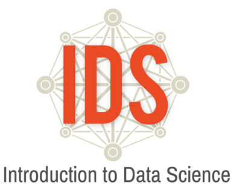

# IDS Labs for Introduction to Data Science v 5.0 

## STEM C 

Links to the slides used in the labs are listed below

### Unit 1

[Lab 1A - Data, Code & RStudio](../unit_1/lab1a/lab1aRevS.html) 

[Lab 1B - Get the picture?](../unit_1/lab1b/lab1bRevS.html)

[Lab 1C - Export, Upload, Import](../unit_1/lab1c/lab1cRevS.html)

[Lab 1D - Zooming Through Data](../unit_1/lab1d/lab1dRevS.html)

[Lab 1E - What's the Relationship?](../unit_1/lab1e/lab1eRevS.html)

[Lab 1F - A Diamond in the Rough](../unit_1/lab1f/lab1fRevS.html)

[Lab 1G - What's the FREQ?](../unit_1/lab1g/lab1gRevS.html)

[Lab 1H - Our Time](../unit_1/lab1h/lab1hRevS.html)

### Unit 2

[Lab 2A - All About Distributions](../unit_2/lab2a/lab2aRevS.html)

[Lab 2B - Oh the Summaries...](../unit_2/lab2b/lab2bRevS.html)

[Lab 2C - Which Song Plays Next?](../unit_2/lab2c/lab2cRevS.html)

[Lab 2D - Queue It Up!](../unit_2/lab2d/lab2dRevS.html)

[Lab 2E - The Horror Movie Shuffle](../unit_2/lab2e/lab2eRevS.html)

[Lab 2F - The Titanic Shuffle](../unit_2/lab2f/lab2fRevS.html)

[Lab 2G - Getting It Together](../unit_2/lab2g/lab2gRevS.html)

[Lab 2H - Eyeballing Normal](../unit_2/lab2h/lab2hRevS.html)

[Lab 2I - R's Normal Distribution Alphabet](../unit_2/lab2i/lab2iRevS.html)

### Unit 3

[Lab 3A - The Results Are In!](../unit_3/lab3a/lab3aRevS.html)

[Lab 3B - Confound It All!](../unit_3/lab3b/lab3bRevS.html)

[Lab 3C - Random Sampling](../unit_3/lab3c/lab3cRevS.html)

[Lab 3D - Are You Sure About That?](../unit_3/lab3d/lab3dRevS.html)

[Lab 3E - Scraping Web Data](../unit_3/lab3e/lab3eRevS.html)

[Lab 3F - Maps](../unit_3/lab3f/lab3fRevS.html)

### Unit 4

[Lab 4A - If the Line Fits ...](../unit_4/lab4a/lab4aRevS.html)

[Lab 4B - What's the Score?](../unit_4/lab4b/lab4bRevS.html)

[Lab 4C - Cross-Validation](../unit_4/lab4c/lab4cRevS.html)

[Lab 4D - Interpreting Correlations](../unit_4/lab4d/lab4dRevS.html)

[Lab 4E - This Model is Big Enough for All of Us!](../unit_4/lab4e/lab4eRevS.html)

[Lab 4F - Some Models Have Curves](../unit_4/lab4f/lab4fRevS.html)

[Lab 4G - Growing Trees](../unit_4/lab4g/lab4gRevS.html)

[Lab 4H - Finding Clusters](../unit_4/lab4h/lab4hRevS.html)

