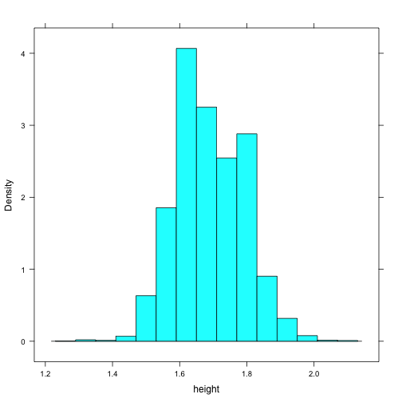

Zooming Through Data
========================
transition: rotate
transition-speed: slow
css: IDSLabCSS.css

Unit 1 - Lab 4

Directions: Follow along with the slides and answer the questions in **red** font in your journal.


Data with Clarity
=================

- We've looked at graphs of entire variables (All of their values).
- Doing this is helpful to get a **big picture** idea of our data.
- For example, load the CDC data from the previous labs and run this command to look at our survey taker's *heights*.


```r
histogram(~height, data = cdc)
```


Let's start with the big picture
================================

- **Interpret this graph. What does it tell you about which variable?**




Subsetting
=====================

- To get a better idea of the details of our data, we need to learn how to **subset**
- **Subsetting** is when look at a small portion of the data.
    - We sometimes call **subsetting** _conditioning_.
    - Usually, the smaller portion are all similar in some way.
- There's _many_ ways to subset data using RStudio, we'll focus on learning the most common methods.

Subsetting numerical variables
==============================

- Start with all of our values for **heights** and make a histogram.


```r
histogram(~height, data = cdc)
```


- We can **separate** (often called **facet**) our data based on a categorical variable with the `|` key. 


```r
histogram(~height | gender, data = cdc)
```

 
- **Run each line of code. How does the plot change after you _separated_ the variables?**

Subsetting numerical variables
==============================

- It would be much easier to compare the heights of males and females if the histograms were stacked on top of one another.
- We can change the **layout** of our separated plots by including the `layout` argument. 
- Type the following command into your console.

```r
histogram(~height | gender, data = cdc, 
          layout = c(1,2))
```


- **How does the heights of males and females differ?**
- **Are the shapes of the height's distributions similar or different?**
  
  Subsetting numerical data
=========================
  
- Another way to subset our data would be to look at the values for just females or just males. 
- We can do this with the `subset` argument
- Type the following command into the console


```r
histogram(~height, data = cdc, 
          subset = (gender == "Male"))
```


- **How would you translate `subset = (gender == "Male")` into everyday English?**
  
So what's really going on?
==========================

Here's a breakdown of what your code is telling `R`.
 

```r
histogram(~height, data = cdc,  
          subset = (gender == "Male"))
```


- **histogram**: Make a _histogram_ ...
- **~weight**: using the variable _weight_ ...
- **data = cdc**: from the _cdc_ data set ...

So what's really going on?
==========================

Here's a breakdown of what your code is telling `R`.


```r
histogram(~height, data = cdc,  
          subset = (gender == "Male"))
```


- **subset = (gender == "Male")** 
    - Before making the plot, _subset_ the values ...
    - Using only the rows where the variable _gender_ ...
    - Is 'exactly equal' to (_==_) ...
    - The value of _"Male"_
- **How does your translation of `subset = (gender == "Male")` compare to the translation above?**

What is exactly equal ("==")
============================

- When you use a double equal sign, "=="
- You're **asking** R if a _variable_ is equal to a _value_
- Type these commands into the console:
  

```r
x <- 5
```


```r
x == 5
```


```r
x == 6
```


Review
======

- **Explain how R interprets each step in the following code:**

```r
x <- 5
```


```r
x == 5
```


```r
x == 6
```


Answers
=======

- Assign the value of `5` to the object named `x`

```r
x <- 5
```


- Find out if the object `x` is equal to `5`

```r
x == 5
```


- Is the object `x` equal to `6`?

```r
x == 6
```


Back to subsetting ...
======================

- Subsetting doesn't only have to occur when plotting.
- Sometimes we'd like to be able to subset all of our data.
    - This lets us _zoom_ into the data to get a more detailed view of our data.
- We do this with the `subset()` function.

Subsetting our data
===================

- Suppose we're interested in only looking at the students in our `cdc` data set with asthma.
- We'll create this new data set using the following:

```r
cdc_asthma <- subset(cdc, asthma == "Yes")
```


- **What happened in the _environment_ pane after running the code?**

Break it down
=============

- **Explain each part of:**


```r
cdc_asthma <- subset(cdc, asthma == "Yes")
```


- **`cdc_asthma`:**
- **`<-`:**
- **`subset`:**
- **`cdc`:**
- **`asthma == "Yes"`:**

On your own!
==========================

- Using the CDC data:
- **Choose a categorical variable**
    - **Create a subset of your data based on one of the values of your variable**
- **Choose a second categorical variable using your subset data**
    - **Create a bargraph of this second variable**
- **Choose a third categorical variable**
    - **Split the bargraph you created into different bargraphs based on the value of this third variable**
    
