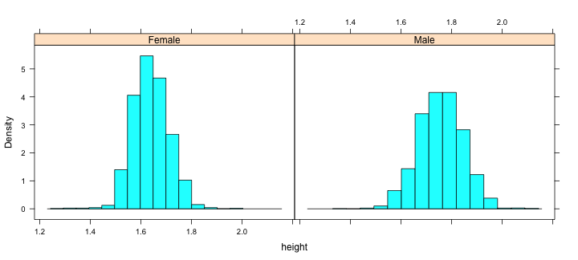
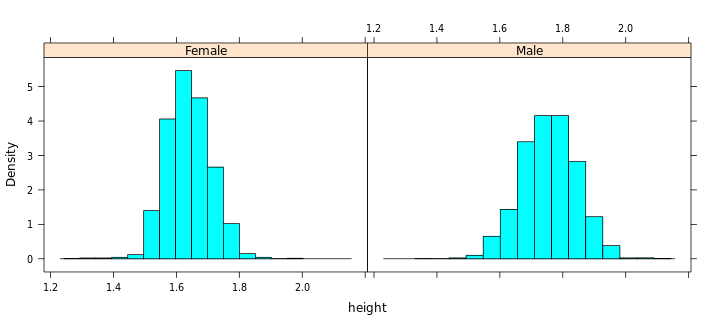
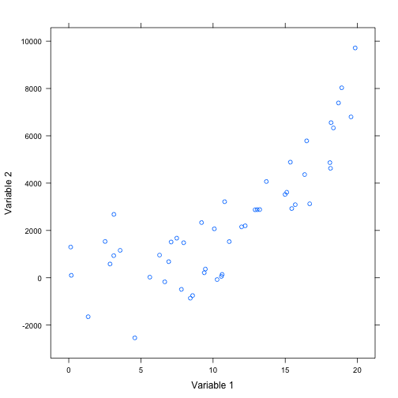
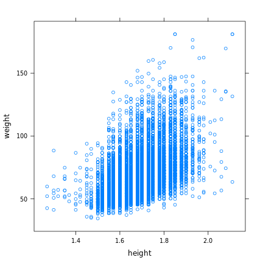
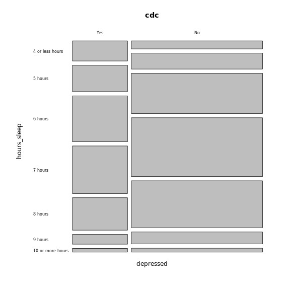
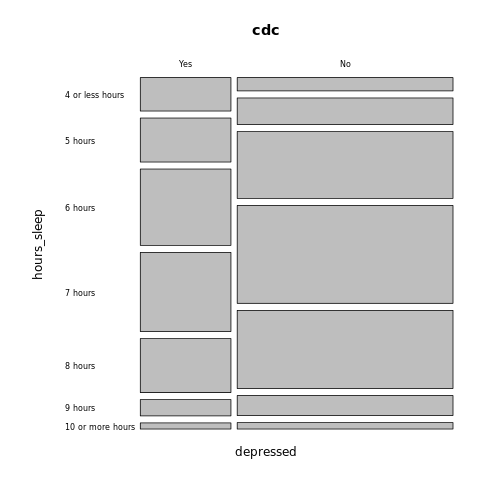

Visually Exploring Relationships in Data
========================================
transition: rotate
transition-speed: slow
css: NSFLabCSS.css

Unit 1 - Lab 5

Directions: Follow along with the slides and answer the questions in **red** font in your journal.


I have data, now what?
======================

- Load the `cdc` data set and run the following code in RStudio:

```r
View(cdc)
```


- **Using only the output of the code, write down something you think is interesting about the data.**
- **How interesting do you think your observation is? Would anybody else find it interesting if you told them?**

Finding patterns in data.
=========================================

- To discover (_really_) interesting observations or relationships in data, we need to find them!
    - Which is difficult if we only look at the data itself.
- The best tool for finding patterns is often ... your own eyes.
    - Plots are an excellent way to help your eye search for patterns.

What do you observe?
==============

- Start by looking at a plot you've seen before:

```r
histogram(~height, data = cdc)
```


- **How many variables did you need to make this plot?**
- **What sorts of observations can you make about the height of our data's high schoolers?**

What do you observe now?
========================

- Using what you learned in _lab 1.4_, create this plot **BUT** stack one graph on top of the other.  




What do you observe now?
=========================




- **How many variables did you need to make your plot?**
- **In your plot, what do you notice about the heights of _males_ and _females_?**
- **Compare your plot to the one above. Which is easier to see the difference in heights?**

Multiple variable plots
=======================

- The plot you just made is an example of a _multiple variable plot_
  - Often shorten this to _multivariate plot_
  - Variable 1: _height_
  - Variable 2: _gender_
- Multivariate plots are tools for finding _relationships_ between data.
- Let's make some new multiple variable plots you haven't created before!

Scatter plots
=============




Scatter plots
=============

- Useful for viewing how one _numerical_ variable relates to another _numerical_ variable.
- Before we begin:
  - **How do you think _height_ and _weight_ are related?**

Creating scatter plots
======================

- To create scatter plots, use the following function:
**<p align='center'> xyplot (y ~ x, data = ____ ) </p>**
- Use the _height_ and _weight_ variables to create this plot:



Answer the questions based on your plot
======================================

- **As people grow taller, what happens to their _weight_?**
- **Pick a single _height_, does weight vary a lot or a little? Why do you think that is?**
- **Does the weight of shorter people vary less, more, or the same amount as taller people?**
- **What happens if you swap the _height_ and _weight_ variables in your code? Does the relationship between the variables change?**

More complex scatter plots
=======================

- What happens to your plot if you run this code:

```r
xyplot(weight ~ height | gender, data = cdc)
```


- **How is this code different than the one you ran previously?**
- **Do you think the relationship between _heights_ and _weights_ for _males_ and _females_ are more similar or different?**
- **How many variables did you need to create this plot?**

Adding some color
======================

- In the previous plot, we looked at how different gender's _heights_ and _weights_ varied seperately.
  - What if we wanted to overlay (combine) them?
- Run the following code:

```r
xyplot(weight ~ height, data = cdc, groups = gender)
```


- **How is this graph different than the previous graph? What changed in the code to make it different?**

Mosaic Plots
============




Mosaic Plots
============

- Scatter plots are helpful for finding relationships between two _numeric_ variables.
- Mosaic plots are helpful for finding relationships between two _categorical_ variables.
- We use the following function to create them:
**<p align='center'> mosaicplot (y ~ x, data = ____, las = 1) </p>**
**NOTE:** We include `las=1` to ensure our labels are readable.


Create the following:
=====================

- Use the variables _depressed_ and *hours_sleep* to create this mosaic plot:



Playing with labels
===================

```r
mosaicplot(depressed~hours_sleep, data=cdc, las=1)
```


- **What happens to the labels if you set `las = 0`? Or `las = 2`?**
- **What happens if you don't include `las = 1` at all?**

Interpreting mosaic plots
=========================

- To interpret mosaic plots, we need to look for differences in the width and height of the boxes.
- For the mosaic plot you've created:
  - The width of the boxes is the **percentage** of students who said they have or have not felt depressed.
  - The height of the boxes is the **percentage** of students who said they sleep however many hours.
- The width/height of the _entire_ plot represents 100 percent of the students.
  
Interpreting mosaic plots
=========================  
  
- Compare the width of the _Yes_ and _No_ stack for the _depressed_ variable:
  - **Have more high schoolers reported feeling depressed or not depressed?**
- Now look at the heights of the boxes in the _yes_ stack:
  - **For high schoolers who have reported feeling depressed, which are the two most common amounts of sleep?**

  
Interpreting mosaic plots
=========================

- Look at the heights of the boxes in the _no_ stack:
  - **For high schoolers who not have reported feeling depressed, which are the two most common amounts of sleep?**
- Finally, look at the people who reported sleeping _4 or less hours_:
  - **How does the percentage of students who reported feeling depressed and sleeping 4 or fewer hours compare to the students who did not report feeling depressed and sleeping 4 or fewer hours?**
