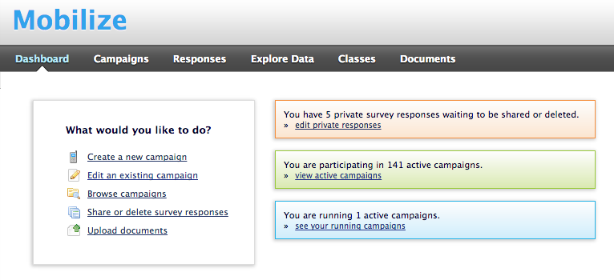
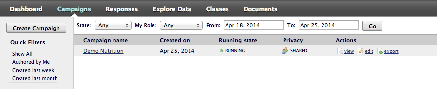
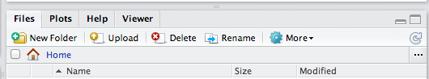
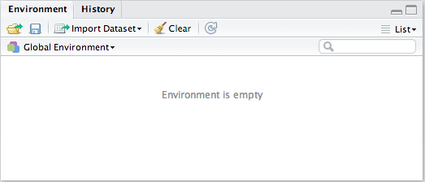
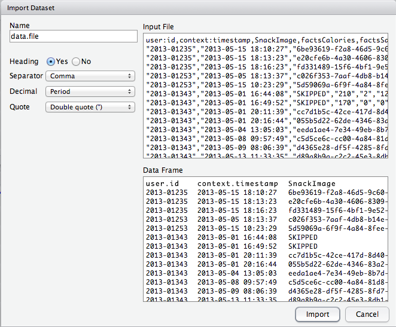

Unit 1 - Lab 6

Directions: Follow along with the slides and answer the questions in **red** font in your journal.

```{r, eval=TRUE, echo=FALSE, results='hide', message=FALSE, warning=FALSE}
require(mosaic)
load("~/Dropbox/IDS Curriculum Design/Labs/Unit 1 Labs/Data/cdc.rda")
```


Download, upload, load
========================================================
- Before we can perform any analysis, we have to load data into R. 
- First, identify the data we want to analyze. Then
    - **Download** the data onto the computer
    - **Upload** data to RStudio server
    - **Load** data into R's working memory
  

Downloading
========================================================

- To begin, go to the [Mobilize Landing Page](https://lausd.mobilizingcs.org/landing/). 
    - Click on the **Web Frontend**
    - Fill in your username and password and click "Sign in."

If you forget your username or password, ask your teacher to remind you. 

Mobilize web front end
========================================================



- After logging in, your screen should look like this.
- Click on the **Campaigns** tab.

Campaigns tab
========================================================


- When you click on the campaigns tab your screen should look something like this. 
- Find the campaign you would like the data for:
    - At the right side of the screen, look for the link labeled **Export** Click it.
    - Remember where you save your file!

Downloading
========================================================

- When you clicked the **Export** link a _csv_ file was saved on your computer.
- Now that the file is on your computer, we need to **upload** it into RStudio.


Uploading
========================================================

- Look at the four different _panes_ in RStudio.
    - Find the _pane_ with a **Files** tab.
    - Click it!


Uploading
========================================================
<center>  </center>

- Click the button on the Files pane that says "Upload"
    - Find the SurveyResponses.csv file you saved to your computer.
    - Hit the _ok_ button a few times.
- Voila!
    - If you look in the **Files** tab, you should be able to find your data!


A word on staying organized...
==============================
<center>  </center>

- The **Files** tab has a few other features to help keep you organized.
    - _SurveyResponse_ probably isn't the best name for your data. Click **Rename** to give it a clearer name.
    - If you click on **More**, you'll find an option to **Move** your data. You might consider keeping all of your data files together by **Move**-ing your data into the same folder.


Loading
========================================================

- By **Uploading** your data into RStudio you've really only given yourself access to it.
    - Don't believe me? Look at the **Environment** tab ... where's your data?
- To actually use the data we need to **Load** it into your computer's memory.
- R can't remember all the datasets we have at once, which is why there's a seperate step between **Uploading** and **Loading**.


Loading
========================================================



- At the top of the Environment pane, click the "Import Dataset" button. Then, choose "From Text File."
- Find your _SurveyResponse_ data and then click _Open_.


Data Preview
========================================================
<center></center>

- Give your data a **Name**. This is the name you'll use in your code.
- When you're ready, click the _Import_ button.


read.csv()
========================================================

- After you click import you might notice something appeared in your console.
```{r,eval=FALSE}
data.file <- read.csv("~/SurveyResponse.csv")
View(data.file)
```

- We can actually **Load** the data without clicking the button!
    - This would allow you to load data by writing code! 
    - This might come in handy later in the course.

Download, upload, load
========================================================

- It's time to play with data!