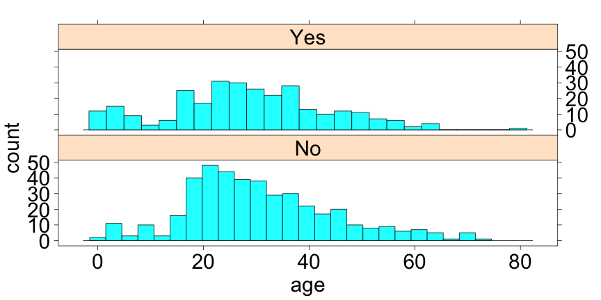

Permuted Data & Graphics
========================================================
transition: rotate
transition-speed: slow
css: IDSLabCSS.css

Unit 2 - Lab 6  

Directions: Follow along with the slides and answer the questions in **red** font in your journal.
 


Why permute data?
=================

- **Permuting** data is a really simple technique to _shuffle_ or _randomize_ our data.
- Why do we bother?
    - So we can compare our data's distributions with examples that we know for a fact (100% certain) are random.
- And why is this helpful?
    - We can get a sense of how _random_ or _non-random_ our data is.
    
The Titanic
===========

- The Titanic was a ship that sank en route to the U.S.A. from England after hitting an Iceberg in 1912.
- One common thought is that younger people were given priority when boarding the lifeboats.
- Use the following to load our `titanic` passenger and survival data.

```r
data(titanic)
```


What do you think?
==================

- Take a look at the following plot about the age of survivors and non-survivors.
- **Was the _typical_ survivor younger than the _typical_ non-survivor? Give an argument as to why.**




Let's find an answer!
=======================

- Let's start by calculating how much younger the _typical_ survivor was than the _typical_ non-survivor in our data.

```r
mean(~age | survived, data = titanic)
```

- Uh oh! It looks like we've stumbled upon some **missing data**.
    - We use the value `NA` to indicate we have a value that's missing.
- **What do you think we mean when we say _missing data_? Why might it be missing?**

Dealing with missing data
=======================

- We don't know the `age` of some people in our data.
- Run the following:

```r
favstats(~age, data = titanic)
```


- Since we're only missing 177 of our 714 observed heights, we can _remove_ those missing values from our calculation and still get a good estimate for each gender's typical height.
- **Write down a circumstance when you think we shouldn't remove missing data**

Computing the difference in aveage ages
======================

- To remove our missing values and compute the average `age` for survivors and non-suvivors, run:

```r
mean(~age | survived, data = titanic, 
     na.rm = TRUE)
```


- The argument `na.rm = TRUE` tells R to find the _missing values_ and remove them before calculating the median.
- **How much younger is the average suvivor than the average non-survivor in our _actual_ `titanic` data?**


Randomizing our data
====================

- Now that we've calculated the difference of our passenger's average ages, we'd like to compare it to data that we've randomized.
- Run the following to completely randomize the `survived` status for each person's `age`:

```r
mean(~age | survived, 
     data = resample(titanic,
                     shuffled="survived"),
     na.rm = TRUE)
```


Resampling (a.k.a. permuting)
=========================


```r
mean(~age | survived, 
     data = resample(titanic,
                     shuffled="survived"),
     na.rm = TRUE)
```


- When we write, ` data = resample(titanic, shuffled="survived")`, we're telling R to:
    - Start with our original `titanic` data and ...
    - Take the the _Yes_ and _No_ values in our `survived` variable and mix them up...
- Then! With this randomized data:
    - Find the average `age` of our _randomized_ survivors and non-survivors.
    

Why shuffle (or resample)?
==========================

- By shuffling the values of _Yes_ and _No_ in our `survived` variable:
    - We keep the same number of total survivors.
    - But! We _randomly_ choose which passengers survived (or didn't ...)
- This means that, any relationship between `age` and those who `survived` is lost!

    
Answer the following:
===================

- **How much younger is the average survivor than the average non-survivor in our _randomized_ `titanic` data?**
- **Is this number very different than the difference we computed for our _actual_ `cdc` data?**


But how "different" is 'different'?
===============================

- Comparing our _actual_ data to _randomized_ data can be helpful, but we still don't know just _how_ different our _actual_ and _randomized_ values are.
    - This is because we're just comparing our _actual_ values to a single _randomize_ value.
- We can solve this dilemma though by comparing our _actual_ values to _MANY_ _randomized_ ones.
    - Then we can get a sense of how likely our _actual_ values randomly appear.
    
do-ing things many times
==========================

- Just like how we computed our randomized data once, we can use the `do()` function to repeat our calculations many times.
- Run the following example:

```r
do(3)*mean(~age|survived, 
           data=resample(titanic,shuffled="survived"),
           na.rm = TRUE)
```


- **How many times did we randomize our data and then compute the average?**
- **Write down the code you would run to do our calculations 10 times.**
    - **Test your code to ensure it works.**


Calculate many means
========================

- When we `do` a calculation many times, the results are stored as a `data.frame` type object.
    - This means we can save and manipulate our many calculations.
- **Re-run your code from the previous slide BUT ... **
    - **`do` the calculation 300 times AND ...***
    - **Assign the object the name `shuffled_means`**
- **Note**: Doing something 300 times can take a while. Be patient while your code runs.
    - You'll know it's done when the `>` symbol re-appears in your console.

Find many differences
=====================

- Now that we've calculated our many randomized means, we want to calculate how much younger our average survivor was than our average non_survivor.
- To do this, run:

```r
shuffled_diffs <- 
    transform(shuffled_means,
              Difference = Yes - No)
```


Looking at our differences
=====================

- After calculating our 300 randomized differences, we can display them using a histogram:

```r
histogram(~Difference, data = shuffled_diffs)
```


- The values on the x-axis represent how much _younger_ the average survivor was than the average non-survivor.
    - **What does it mean for our difference in average age to be _negative_?**
    
Making the call
===============

- Compare the difference from our actual data, -2.2825, to the histogram of our randomized data.
    - **Is our _actual_ difference close to the values in the center of our histogram? Or are they far away?** 
    - **What does it mean for our _actual_ value to be far away from the center of our randomized values?**
    
Making the call
===============
- If an event doesn't randomly occur very often then we have reason to believe that the event is meaningful.
    - **Is the difference in average ages between _survivors_ and _non-survivors_ meaningful (In our _actual_ `titanic` data)?**
- **Write a sentence as to whether you think the typical survivor was or was not taller than the typical non-survivor. Use evidence from the lab to justify your answer**

- **Is there evidence to support the claim that survivors of the titanic were (typically) younger than non-survivors?**
