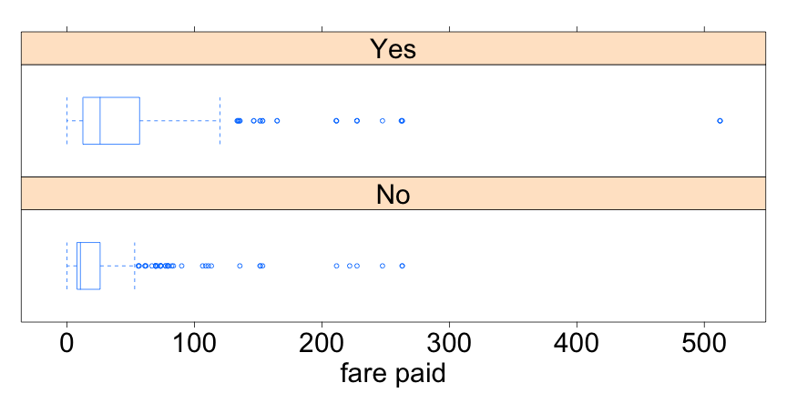

The Titanic Shuffle
========================================================
transition: rotate
transition-speed: slow
css: ../../IDSLabCSS.css

Unit 2 - Lab 7  

Directions: Follow along with the slides and answer the questions in **red** font in your journal.
 


Previously ...
==============

- In the last lab, we learned that by using a `do`-loop and the `resample` function, we could simulate shuffling our data many times.
  - This helps us determine how likely it is that a difference between groups is due to chance.
- For this lab, we will determine if there is any evidence to the belief that wealthier passengers on the Titanic were more likely to survive than poorer passengers.
  - We will consider wealthier passengers to be those that paid a higher fare for their ticket.


The Titanic
===========

- The Titanic was a ship that sank en route to the U.S.A. from England after hitting an Iceberg in 1912.
- Use the following to load the `titanic` passenger and survival data.

```r
data(titanic)
```


What do you think?
==================

- Look at the plot below of fares paid separated by whether the passenger survived or not.
- **Do you believe richer passengers were more likely to survive? Why?**




Let's find an answer!
=======================

- Let's start by calculating how much more the _typical_ survivor paid versus the _typical_ non-survivor in our data.

```r
median(~fare | survived, data = titanic)
```
  - **Based on the boxplots from the previous slide, why would might using the median be a better measure of _typical_ than the mean?**
  - **What was the _typical_ fare paid by survivors? Non-survivers? How much more did the typical survivor pay? Write the code you used to find these answers.**

Do the shuffle!
==============

- **Use a `do`-loop and the `resample` function to shuffle the passenger's survival status 300 times and compute each group's `median` fare paid. Save your shuffled data as a new object called `shfl_med`**
- **Use the `transform` function to add a variable called `Diff` to the shuffled medians you just calculated. Save these values as a new object called `shfl_diff`**
  - See the previous lab if you need help.
  - The `Diff` variable should account for how much _more_ the survivors paid than the non-survivors.
- **Write the code you used to create `shfl_med` and `shfl_diff`.**
  

Put your simulations data to use
===============================

- Create a plot of the differences in the fare paid for your randomized _survivors_ and _non-survivors_.
- **What was the _actual_ difference in the median fare paid by survivors and non-survivors in the data? Based on your plot, do you think this difference is _big_? Why?**


Convert & compare z-scores
=========================

- **Compute the `mean` and standard deviation of your 300 randomized differences?**
  - **Convert the _actual_ difference you computed to a z-score using the _mean_ and _standard deviations_ you just computed. Write down the z-score you calculated.**
  - **How many standard deviations away from the mean is the actual median difference in fares paid by survivors and non-survivors?**
  

Extreme z-scores!
================

- Data scientists usually consider any z-score larger than 3 or smaller than -3 to be _extreme_.
  - And by _extreme_ we mean that they occur so rarely by chance alone that we start to believe that something besides chance alone is causing the z-scores to be so large.
- To show how rare these z-scores occur by random chance, let's use our 300 simulated median differences to estimate the probability of obtaining an _extreme_ z-score.


Probably z!
===========

- Follow along to convert your `Diff` variable to z-scores:

```r
mean_diff <- mean(~Diff, data=shfl_diff)
```

```r
sd_diff <- stdev(~Diff, data=shfl_diff)
```

```r
shfl_zscores <- 
  transform(shfl_diff, 
            zscore=(Diff-mean_diff)/sd_diff)
```
- **Use the `subset` and `nrow` functions to compute the estimated probabilities of a z-score being larger than 3, smaller than -3, and larger than 3 OR smaller than -3.**


On your own
===========

- **Redo your simulation and the analysis, BUT this time use the `mean` fare paid instead of the `median` fare paid.**
  - **Does your conclusion change depending on the method you use to describe the _typical_ fare paid by survivors and non-survivors? Explain.**
- After redoing your analysis using the `mean` instead of the `median`, answer the following:
  - **If a journalist walked up to you right now and asked if the amount of fare paid for a Titanic ticket had an effect on a person's probability of surviving, what would you say? How would you justify your answer?**
