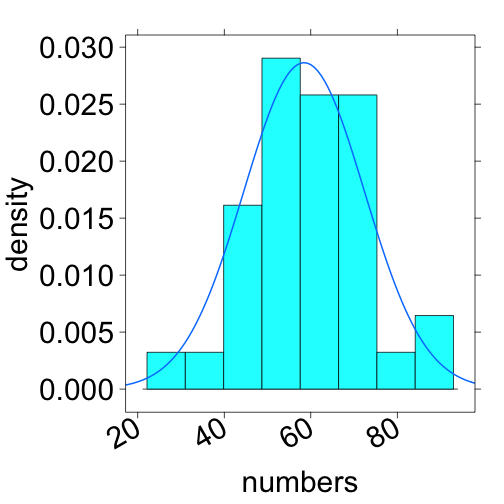
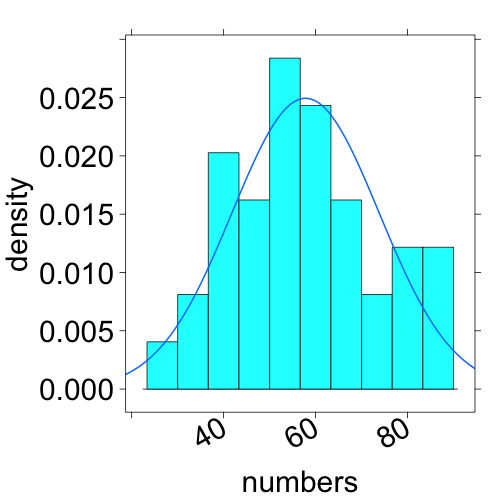

Normal Simulations
========================================================
transition: rotate
transition-speed: slow
css: ../../IDSLabCSS.css

Unit 2 - Lab 13

Directions: Follow along with the slides and answer the questions in **red** font in your journal.
 


Normal, Normal .. Gaussian?
==========================

- The history of the Normal curve is really neat (from a nerdy data science-y perspective).
  - Anyways, the Normal curve is also called a _Gaussian_ curve in honor of the great scientist Carl Friedrich Gauss. The more you know...
  
- In the last lab, we looked at how over-laying a Normal curve on distributions of our data can help us decide if our data has a _Normal_ distribution.
- In this lab, we will learn how to simulate draws from a Normal curve to help us make this decision, and we will see what these simulations can teach us about modeling in general.


Simulating Normal draws
========================

- We have already looked at using simulations to draw marbles from a bag.
- Now, we can simulate draws from a Normal distribution by using the following function:

```r
rnorm(n, mean, sd)
```
- `rnorm` stands for _random Normal numbers_.
  - `n` is the number of draws we want.
  - `mean` is where the distribution is centered.
  - `sd` is the standard deviation for the distribution. It says how much our data varies.
  
  
Give it a try
=============

- Let's actually generate some draws and then view these draws as a histogram:

```r
draws1 <- rnorm(n=25, mean=0, sd=1)
```

```r
histogram(draws1, fit='normal')
```

- **Based on your histogram, do you think your values are Normally distributed? Why or why not?**
- Create two more histograms, but change the values of `n` to `n=100` and `n=300`.
  - **Describe what happens as the size of `n` increases.**


Size matters
==========

- Hopefully, you noticed that your simulations started looking more and more like they would fit a _Normal curve_ as the number of draws increased.
- This highlights a really important topic for data scientists:
  - We know for a fact that we drew our simulations from a Normal distribution.
  - But this fact only became _obvious_ as the size of our simulations increased.
- The big lesson to take away? It's hard to recognize a phenomenon if you don't collect enough information about it.


Everyone loves the lotto!
======================

- Run the following code to load the `lotto` data set:

```r
data(lotto)
```

- This data set contains the numbers drawn for the last however many MEGA Millions lottery draws.
- The values of `num_1` through `num_5` are drawn, without replacement, from the numbers 1 to 47.
  - In our data, `num_1` will always be the smallest number of the 5 drawn, `num_2` will always be the next smallest, and so on.
- The MEGA number is always between the numbers 1 and 27 and is drawn separately from the first 5 numbers.


Using simulations
=================

- Create a histogram for the 3rd smallest number drawn (`num_3`).
- **Do you think the 3rd smallest regular number drawn is Normally distributed? Why?**
- Calculate the mean and standard deviation for `num_3`. Use these values to simulate 1,000 draws from a Normal distribution.
  - Create a histogram of these simulated draws.
- **Compare the histograms of your simulated and actual data. Do you think they look similar enough to conclude that the the 3rd smallest drawn number is Normally distributed? Why or why not? Include your plots.**


On your own
==============

- Simulations can be used as a tool to help us fit models (such as the _Normal_ model) to data.
- Try using different settings in the `rnorm` function to create histograms that look roughly similar to the ones on the next slide.
- **Write down the settings for `mean` and `sd` you come up with.** 
  - **What do these tell us about our data?**
  - **Which distribution has a larger spread? Which has a greater center value?**
  
  
Fit your models to these:
===========
  
 
***
 
