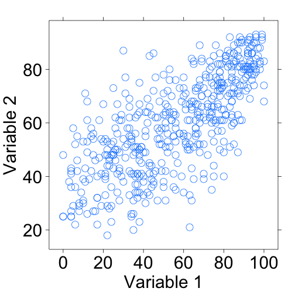

Interpreting Correlations
========================================================
transition: rotate
transition-speed: slow
css: ../../IDSLabCSS.css

Unit 4 - Lab 3

Directions: Follow along with the slides and answer the questions in **red** font in your journal.
 


Some background...
==============================
- In the previous lab, you made two models:
  - One made predictions about the amount of money films made based on the `runtime` of the film.
  - The other made predictions based on the number of reviews.
- The type of model we used to make our predictions are called _linear regression models_.
  - _Linear regression models_ work best when the data seem relatively ... line-y.
- For this lab, we will be using the `movie` data set to look at a method to describe how line-y our data are.


Correlation coefficients
===============================
- **Correlation coefficients** describe the _strength_ and _direction_ of the _LINEAR_ relationship between 2 _numerical_ variables.
  - The term seems scary, but really _Correlation_ is just a fancy word for 'related' and _coefficient_ is just a fancy word for number.
  - So _correlation coefficient_ is a fancy term for a number that describes how two variables are (linearly) related.


Look at 2 of the variables in a scatter plot
==============================



Some questions
==============================

- **Do you think the two variables are related? Why or why not?**
- **Does the plot show a positive or negative association (As the values of $x$ increase, do the values of $y$ increase or decrease)?**
- **Is the association linear (Do the data seem to resemble a line? Or a curve?)**
- **What would you estimate the correlation coefficient to be? Do you think it should be positive or negative? Why?**


Calculating Correlation Coefficients!
==============================

- We can use the `cor()` function to find the particular correlation coefficient of the previous two variables which happen to be `audience_rating` and `critics_rating`.
- So first, load your data by running:

```r
data(movie)
```
- And then use the following code to calculate the correlation coefficient.

```r
cor(audience_rating~critics_rating, 
     data = movie)
```

Now answer the following.
==========================================

- Using the correlation coefficient you calculated, answer the following.
- **What value was output by the `cor()` function?**
- **How does this actual value compare with the one you estimated previously?**
- **Does this indicate a strong, weak, or moderate association? Why?**
- **How would the scatter plot need to change in order for the correlation to be stronger?**
- **How would it need to change in order for the correlation to be weaker?**


What if we changed the data?
===============================
- **Would the correlation coefficient change if we took all of our values and subtracted 50 from all of the `critics_score`? Why do you think this is?**
- Test your answer by running the following code:

```r
cor(audience_rating~(critics_rating-50), 
     data = movie)
```
- **What value was returned for the correlation coefficient?**
- **How does this actual value compare with the one you estimated previously?**

What if we changed the data, again?
===============================

- **What happens to the correlation coefficient if we multiplied all of the `critics_rating` values by 50?  How do you explain this?**
- Test your answer by running the following code:

```r
cor(audience_rating~(critics_rating*50), data = movie)
```
- **What value was returned for the correlation coefficient?**
- **How does this actual value compare with the one you estimated previously?**


Back to your own variables
===============================
- Select a different pair of numerical variables from your `movie` data.
  - That is, don't choose `critics_rating` and `audience_rating`.
- **Plot the variables using the `xyplot()` function.**
  - **Does the plot show a positive or negative association? Why?**
  - **Is the association linear? Why?**
  - **Calculate the correlation coefficient.**
  - **What does this mean about the strength of the relationship between these two variables?**
  

Finishing up
==============================
- **Work with your classmates to determine which two variables have the strongest correlation? Report the variables and the corresponding correlation coefficient.**
- Once you find the pair, answer the following:
  - **Does the relationship between the two variables appear to be linear?**
  - **Why do you think these variables are so strongly related?**
