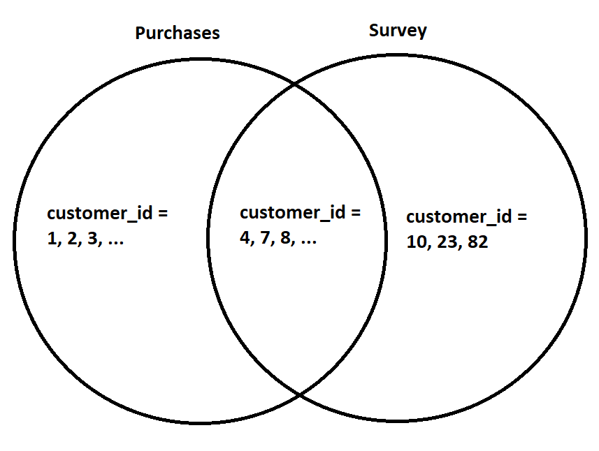
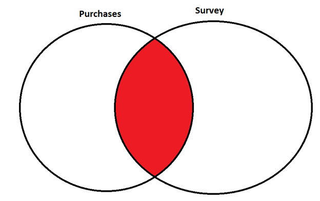
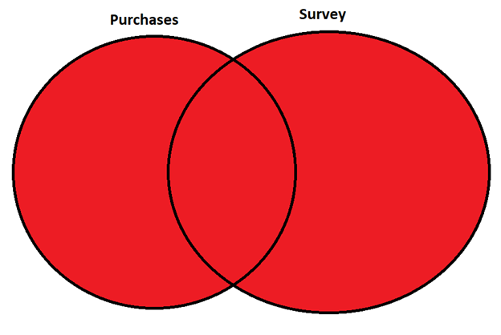
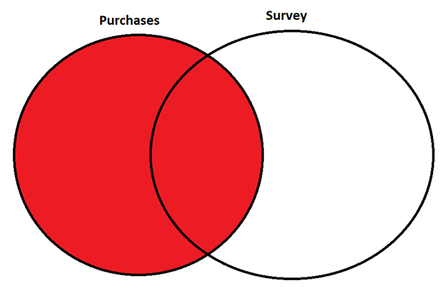
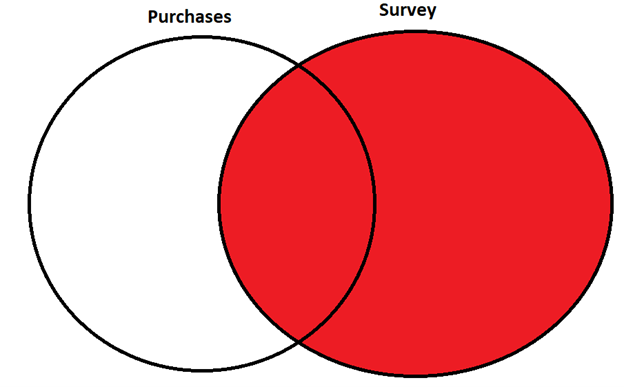
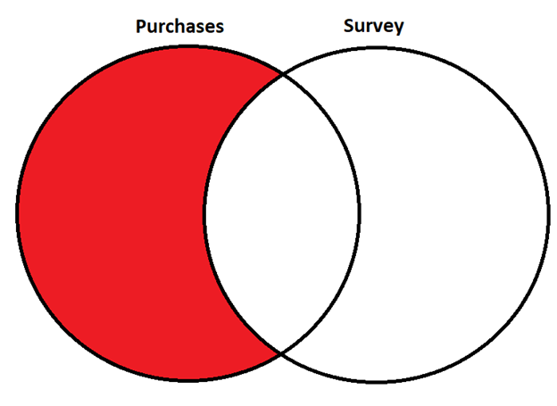

## Overview

<ul>

<li>Previously, you learned how to use <span style="color: blue;">merge</span> to <b>join</b> data sets horizontally. This is where we take one data set's columns and add them to the end of the other data set's columns based on matching an <b>ID</b> variable. <span style="color: blue;">colors</span> and <span style="color: blue;">timeuse</span> were merged using <span style="color: blue;">user.id</span> as an ID.</li>

<li>In this lab, we will learn some alternative ways to join two datasets. These are <b>inner joins</b>, <b>outer joins</b>, <b>left and right joins</b>, and <b>anti joins</b>. Before diving in, let's get to know our example datasets.</li>

<li>Type the following commands into your console:</li>

```{r, eval = FALSE, echo = TRUE}
data(purchases)
```

```{r, eval = FALSE, echo = TRUE}
?purchases
```

```{r, eval = FALSE, echo = TRUE}
data(surveys)
```

```{r, eval = FALSE, echo = TRUE}
?surveys
```

<li><span style="color: red;"> Do <span style="color: blue;">purchases</span> and <span style="color: blue;">surveys</span> have the same number of observations?</span></li>

<li><span style="color: red;"> What variables do <span style="color: blue;">purchases</span> and <span style="color: blue;">surveys</span> have in common? What variables are not shared by <span style="color: blue;">purchases</span> and <span style="color: blue;">surveys</span>?</span></li>

</ul>

## Motivation

<ul>

<li>Notice that both <span style="color: blue;">purchases</span> and <span style="color: blue;">surveys</span> contain the variable <span style="color: blue;">customer_id</span> - this will be the ID on which we join <span style="color: blue;">purchases</span> and <span style="color: blue;">surveys</span>.</li>

<li>Previously, <span style="color: blue;">colors</span> and <span style="color: blue;">timeuse</span> had the same number of observations. Moreover, the values for <span style="color: blue;">user.id</span> were exactly the same in <span style="color: blue;">colors</span> and <span style="color: blue;">timeuse</span>.</li>

<li>In contrast, <span style="color: blue;">purchases</span> and <span style="color: blue;">surveys</span> contain different amounts of observations. Moreover, some values of <span style="color: blue;">customer_id</span> occur in both <span style="color: blue;">purchases</span> and <span style="color: blue;">surveys</span>, some occur only in <span style="color: blue;">purchases</span>, and some occur only in <span style="color: blue;">surveys</span>. We can express this relationship using a <b>Venn diagram</b>.</li>

```{r, echo=FALSE, out.width="60%", out.height="60%"}

```

<li>The positions of datasets on a Venn diagram allow us to designate one dataset as the <b>left dataset</b> and the other as the <b>right dataset</b>. In this case, <span style="color: blue;">purchases</span> is the left dataset and <span style="color: blue;">surveys</span> is the right dataset.</li>

<li><span style="color: red;">Run the following code:</span></li>

```{r, eval = FALSE, echo = TRUE}
merge(purchases, surveys, by = "customer_id")
```

<li><span style="color: red;">Which values of <span style="color: blue;">customer_id</span> are present in the resulting dataset? Do these observations correspond to a section from the Venn diagram?</span></li>

</ul>

## Inner joins

<ul>

<li>The first way to join two datasets is an <b>inner join</b>, which includes a observation when its ID is present in the left <b>AND</b> right datasets. In our example, this would be the set of people that made a purchase at the store <b>AND</b> filled out the survey. This is illustrated in the Venn diagram:</li>

```{r, echo=FALSE, out.width="60%", out.height="60%"}

```


<li>Notice that this is exactly the behavior of <span style="color: blue;">merge</span>. This means that <span style="color: blue;">merge</span> carries out an inner join! In fact, the following code produces the exact same output as the code from the previous slide.</li>

```{r, eval = FALSE, echo = TRUE}
inner_join(purchases, surveys, by = "customer_id")
```

<li><span style="color: red;">Inner join <span style="color: blue;">purchases</span> and <span style="color: blue;">surveys</span> and assign the output to <span style="color: blue;">inner_customers</span>.</span></li>

<li><span style="color: red;">Does <span style="color: blue;">inner_customers</span> have more or fewer observations than <span style="color: blue;">purchases</span>? What about <span style="color: blue;">surveys</span>?</span></li>

<li><span style="color: red;">What are the variables of <span style="color: blue;">inner_customers</span>?</span></li>

<li><span style="color: red;">Is there a relationship between <span style="color: blue;">age</span> and <span style="color: blue;">average_amount_spent</span>?</span></li>

</ul>

## Outer joins

<ul>

<li>A second way to join two datasets is an <b>outer join</b>, which includes a observation when its ID is present in the left <b>OR</b> right datasets. In our example, this would be the set of people that made a purchase at the store <b>OR</b> filled out the survey. This is illustrated in the Venn diagram:</li>

```{r, echo=FALSE,out.width="60%", out.height="60%"}

```


<li>The syntax for all the join functions is the same as <span style="color: blue;">merge</span>:</li>

```{r, eval = FALSE, echo = TRUE}
merge(____, ____, by = "____")
```

<li>where <span style="color: blue;">"merge"</span> is replaced with the specific join function you'd like to use. The join function corresponding to outer join is <span style="color: blue;">full_join</span>.</li>

<li><span style="color: red;">With this in mind, create an outer join of <span style="color: blue;">purchases</span> and <span style="color: blue;">surveys</span>, and assign it to <span style="color: blue;">outer_customers</span>.</span></li>

<li><span style="color: red;">How many observations and variables does <span style="color: blue;">outer_customers</span> have compared to <span style="color: blue;">inner_customers</span>?</span></li>

<li>You might have noticed that <span style="color: blue;">outer_customers</span> contains <span style="color: blue;">NA</span> values, but <span style="color: blue;">inner_customers</span> does not. <span style="color: red;">Why does this happen?</span> (Hint: what happens when a value of <span style="color: blue;">customer_id</span> occurs in <span style="color: blue;">purchases</span>, but not <span style="color: blue;">surveys</span>, or vice versa?)</li>

</ul>

## Left and right joins

<ul>

<li>Two more kinds of joins are <span style="color: blue;">left_join</span> and <span style="color: blue;">right_join</span>. As the names suggest, <b>left joins</b> keep all the observations in the left dataset, and <b>right joins</b> keep all the observations in the right dataset. See the Venn diagrams below:</li>

```{r, echo=FALSE,out.width="60%", out.height="60%"}

```

```{r, echo=FALSE,out.width="60%", out.height="60%"}

```


</ul>

## Anti joins

<ul>

<li>The last join function is <span style="color: blue;">anti_join</span>. <b>Anti joins</b> are a bit unlike the other join functions - rather than adding observations to the left dataset, anti_join <b>filters</b> observations from the left dataset. Anti joins keep all the observations of the left dataset that do not have matches in the right dataset. This is illustrated in the Venn diagram:</li>

```{r, echo=FALSE,out.width="60%", out.height="60%"}

```


<li><span style="color: red;">Create a dataset called <span style="color: blue;">anti_survey</span> including customers that made a purchase, but did not fill out the survey.</span></li>

<li><span style="color: red;">Produce a box-and-whisker plot for <span style="color: blue;">average_amount_spent</span> amongst customers that made a purchase, but did not fill out the survey.</span></li>

<li><span style="color: red;">How does <span style="color: blue;">average_amount_spent</span> for customers that made a purchase but did not fill out the survey compare to <span style="color: blue;">average_amount_spent</span> for customers that made a purchase <b>AND</b> filled out the survey? How do you interpret the difference?</span></li>

<li>(Hint: make another box-and-whisker plot, but using <span style="color: blue;">inner_customers</span>.)</li>

</ul>