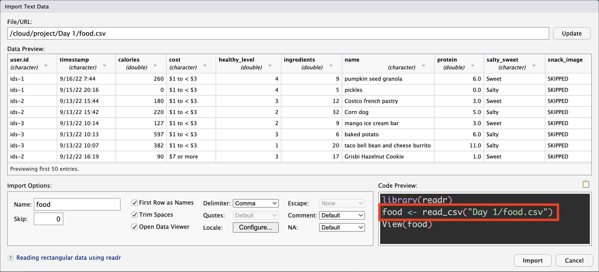

```{r setup, include=FALSE}
```


```{r, eval=TRUE, echo=FALSE, results='hide', message=FALSE, warning=FALSE}
library(dplyr)
library(mobilizr)
data(cdc)
extra_data("food_ids")
```

## Overview

<ul>

<li>In R, **data frames** are a versatile way for storing data. One major advantage of data frames is that their columns can be of different types. That is, while some columns can store **numeric data**, other columns can store **categorical data**.</li>

<li>The best way to store a column of categorical data is using data structure called a **factor**. In this lab we will learn to work with factors.</li>

</ul>

## Factors and levels

<ul>

<li>A factor is a lot like a vector, except it has an additional attribute called **levels**. The levels are the different values that the factor is allowed to take on.</li>

<li>The `str` function can be used to check which columns of a data frame are stored as factors, and how many levels they have.</li>

<li> If you recall from Lab 1B, all but two of the columns of the `cdc` dataset are stored as factors.</li>

<li>**Run the following code to extract the `levels` from `grade`.**.</li>

```{r, eval = FALSE}
cdc %>%
  pull(grade) %>% 
  levels()
```

<li>**How many levels does `grade` have? What are the levels of `grade`?**</li>

<li>**Extract the levels from another categorical variable.**</li>

</ul>

## Why factors?

<ul>

<li>So, why do we care about factors? Couldn't we just use character vectors?</li>

<li>There are a few main advantages to factors:</li>

  <ul>
  
  <li>Factors are more **memory efficient** than character vectors, because they internally store categorical values as integers. This saves time when dealing with large datasets.</li>
  
  <li>By disallowing categories that weren't specified by the levels, factors ensure **data consistency**. Typos and unexpected categories are prevented.</li>
  
  <li>Certain **statistical functions** such as `lm` recognize factors as categorical variables, but might deal with character vectors incorrectly.</li>
  
  <li>Perhaps most importantly (for us), factors are useful when you want to display character vectors in a **non-alphabetical order**.</li>
  
  </ul>

</ul>

## Example

<ul>

<li>To see why we might prefer factors, let's consider an example using the `surveys` dataset.</li>

<li>**Use the `str` function to view the `str`ucture of `surveys`. Does it contain any factors? How is the `favorite_product` column stored?**</li>

<li>Suppose we were interested in seeing a `bargraph` of the `favorite_product` column. Then we might run</li>

```{r, eval = FALSE}
bargraph(~favorite_product, data = surveys)
```

<li>Notice that the columns are listed alphabetically. What if we wanted to list the columns in a different order?</li>

<li>To do so, we will have to turn the `favorite_product` column into a factor, and specify an order for the levels.</li>

  <ul>
  
  <li>The `factor` function is used to turn character vectors into factors. It takes two arguments. The first is the character vector you would like to convert into a factor. The second is the levels of your new factor, **in the order you want them to be displayed**.</li>
  
  </ul>
  
<li>**Run the code below and then create another bargraph of `favorite_product`. What order are the columns displayed in?**</li>

```{r, eval = FALSE}
surveys <- surveys %>%
  mutate(
    favorite_product = factor(favorite_product, 
                              levels = c("T-shirt", "Sweater", "Hoodie", "Cardigan", "Button-up", "Blouse"))
  )
```

<li>**Create a new bargraph of `favorite_product`, using a different column ordering of your choosing.**</li>

</ul>

## droplevels

<ul>

<li>Suppose we are interested in creating a bargraph of the number of `9th grade` and `10th grade` students in the `cdc` dataset. Then we might run</li>

```{r, eval = FALSE}
# filter out observations that are not 9th or 10th graders
underclassmen <- cdc %>%
  filter(grade == "9th grade" | grade == "10th grade")
```

```{r, eval = FALSE}
# create a bargraph
bargraph(~grade, data = underclassmen)
```

<li>Notice that the bargraph still contains columns for the `grade`s that are no longer present in the data. Why did this happen?</li>

<li>Recall from earlier that the `grade` column is stored as a factor, with 5 levels: one for 9th through 12th grade each, and one for other. Even though we filtered out every instance of `11th grade`, `12th grade`, and other from `grade`, we did not tell R that `11th grade`, `12th grade`, and other are no longer levels of `grade`. When we create the bargraph, R thinks we should have a column for every level, including the empty ones.</li>

<li>How do we remove the empty levels from `grade` so that these columns don't appear in a bargraph or as zeros in a tally?</li>

<li>The `droplevels` function takes a factor and drops its empty levels.</li>

<li>**Run the code below and then recreate the bargraph of `grade` using the new `underclassmen` dataset. Which columns are included in the bargraph?**</li>

```{r, eval = FALSE}
underclassmen <- underclassmen %>%
  mutate(
    grade = droplevels(grade)
  )
```

</ul>

## All in one shot

On the last slide, the final product was a visualization. The codes below show how to incorporate a graphic using the pipe. The first utilizes lattice graphics and the second ggplot2.

```{r, eval=FALSE}
cdc %>% 
  filter(grade == "9th grade" | grade == "10th grade") %>% 
  mutate(grade = droplevels(grade)) %>% 
  bargraph(~grade,.)
```

```{r, eval=FALSE}
cdc %>% 
  filter(grade == "9th grade" | grade == "10th grade") %>% 
  mutate(grade = droplevels(grade)) %>% 
  ggplot(mapping=aes(x=grade))+
  geom_bar()
```


## stringsAsFactors

<ul>

<li>Suppose we wanted to initialize a data frame. We might do so with the following code.</li>

```{r, eval = FALSE}
animal_weights <- data.frame(
  animal = c("Dog", "Dog", "Cat", "Cat", "Horse", "Horse"),
  weight = c(100, 150, 8, 11, 900, 1200)
)
```

<li>**Use the `str` function to check how the columns of `animal_weights` are stored. Notice any problems?**</li>

<li>You may have noticed that the animal column is stored as a character vector. We would like for it to be stored as a factor, since `animal` is a categorical variable with three levels.</li>

<li>One way to change the `animal` column into a factor is by mutating it, like in slide 5.</li>

<li>If we wanted `animal` to be stored as a factor from the get go, we could include the `stringsAsFactors` argument when initializing the data frame.</li>

<li>**Run the code below. What is `animal` stored as?**</li>

```{r, eval = FALSE}
animal_weights <- data.frame(
  animal = c("Dog", "Dog", "Cat", "Cat", "Horse", "Horse"),
  weight = c(100, 150, 8, 11, 900, 1200),
  stringsAsFactors = TRUE
)
```

<li>Functions which create data frames, such as `data.frame` and `read.csv`, usually have a `stringsAsFactors` argument, which by default is set to `FALSE`. I.e., when these functions see character vectors, they will store them as character vectors. To override this behavior, you can set `stringsAsFactors` to `TRUE`.</li>

</ul>

## Factors and Food

If you look at the `str`ucture of your food habits data, you will notice that all of the categorical variables are read in as characters. Therefore when you make a bargraph of the `when` variable, they are organized in alpha order.

```{r, fig.width=4, fig.height=4}
bargraph(~when, data=food_ids)
```

Use what you learned in this lab to create the following:

```{r, echo=FALSE}
food_ids<-food_ids %>% 
  mutate(when = factor(when, levels = c("morning", "afternoon",
                                         "evening","night"))
  )
```


```{r,echo=FALSE, fig.width=4, fig.height=4}
bargraph(~when, data=food_ids)
```

## Factors from the get go

You learned how to change the structure of a variable in Lab 1F and got a refresher here as well. What if you wanted to read in a csv file and automatically make the categorical variables factors? You need to read the file in using code.


```{r, echo=FALSE, out.width="60%", out.height="60%"}

```

You can find the code by clicking on the name of the csv file and choosing `Import Dataset...` but DO NOT click on Import. Rather, copy the code below `library(readr)` and paste it onto your console along with the argument `stringsAsFactors = TRUE`.

This code is specific to this file. Notice the food habits data is in a folder called Day 1.

```{r, eval=FALSE}
food <- read_csv("Day 1/food.csv", stringsAsFactors = TRUE)
```

Check the 'str`ucture of the dataframe.

Unfortunately, the order of the levels are assigned in alpha order.  To change the order of the levels you would use the same code learned in slide #5.

