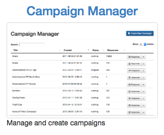
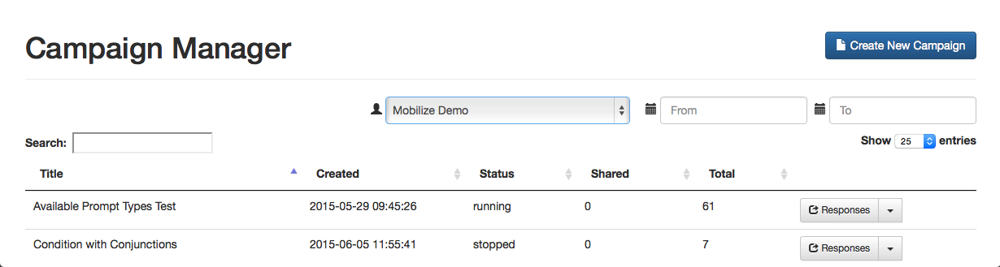
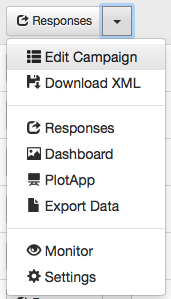
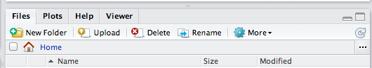
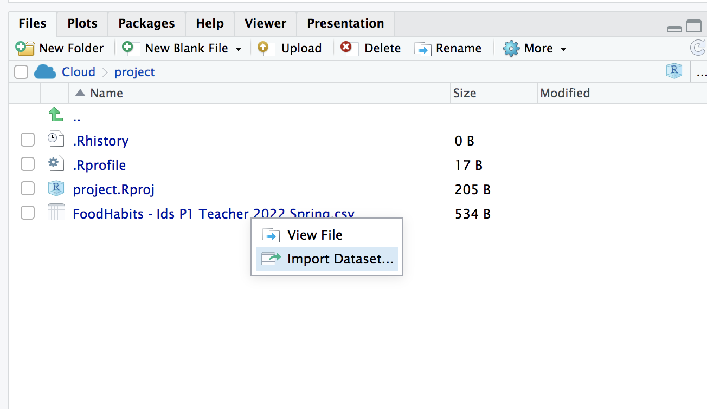

```{r setup, include=FALSE}
knitr::opts_chunk$set(echo = FALSE)
```

```{r, eval=TRUE, echo=FALSE, results='hide', message=FALSE, warning=FALSE}
library(mobilizr)
utils::data(cdc)
```

## Whose data? Our data.

- Throughout the previous labs, we've been using data that was already loaded in RStudio.
    - But what if we want to analyze our own data?
- This lab is all about learning how to load our own participatory sensing data into RStudio


## Export, upload, import

- Before we can perform any analysis, we have to load data into R. 
- When we want to get our participatory sensing data into RStudio, we:
  - <font color="green">Export</font> the data from your class' campaign page.
  - <font color="green">Upload</font> data to _RStudio_ server
  - <font color="green">Import</font> the data into R's working memory
  

## Exporting

- To begin, go to the IDS Tools page.
  - Click on the <font color="green">Campaign Manager</font>
  - Fill in your username and password and click "Sign in."
<center>{ style="max-height: 40vh; max-width: 80%;" }</center>
If you forget your username or password, ask your teacher to remind you. 


## Campaign Manager

<center>{ width=90% }</center>

- After logging in, your screen should look similar to this.
- Click on the dropdown arrow for the campaign you are interested in downloading 
  - At this point in the course, it will most likely be the Food Habits campaign


## Dropdown Arrow

- The options for the dropdown menu will look like this. 
<center>{ style="max-height: 50vh; max-width: 30%;" }</center>
- Look for the option labeled <font color="green">Export Data</font>. Click it.
  - Remember where you save your file!


## Exporting

- When you clicked the <font color="green">Export</font> link a _.csv_ file was saved on your computer.
- Now that the file is on your computer, we need to <font color="green">upload</font> it into RStudio.


## Uploading

- Look at the four different _panes_ in RStudio.
  - Find the _pane_ with a <font color="green">Files</font> tab.
  - Click it!

<center> { width=50% } </center>

- Click the button on the Files pane that says "Upload"
  - Click on "Choose File" and find the SurveyResponses.csv file you saved to your computer.
  - Hit the _OK_ button.
- Voila!
  - If you look in the <font color="green">Files</font> pane, you should be able to find your data!


## Upload vs. Import

- By <font color="green">Uploading</font> your data into RStudio you've really only given yourself access to it.
  - Don't believe me? Look at the <font color="green">Environment</font> pane ... where's your data?
- To actually use the data we need to <font color="green">Import</font> it into your computer's memory.
- To compute more quickly and efficiently, R will only keep a few data sets stored in its memory at a time.
    - By importing data, you are telling R that this is a data set that is important to store it in its memory so you can use it.


## Importing

<center>{ width=50% }</center>

- On the Files pane, find the data you want to import.
- Click on the name of the file and choose the option "Import Data set..." 


## Data Preview

<center>{ width=60% }</center>

- You can give your data a name using the <font color="green">Name: </font> field in the lower left corner.


## What's in a name?

- The name you give your data is what you will use when you write code to analyze your data.
    - Good names are short and descriptive. 
    - For your food habits campaign, some good names to use would be  "foodhabits" or even just "food".
- When you're ready, click the _Import_ button.


## read.csv()

- After you click _Import_ you might notice something appeared in your console.
```{r, eval = FALSE, echo = TRUE}
data.file <- read_csv("~/SurveyResponse.csv")
View(data.file)
```

- This is the actual code `RStudio` uses to read your data when you clicked the _Import_ button. 
  - So instead of using the `RStudio` buttons, we can actually <font color="green">Import</font> by writing code similar to what was output into the console!
  - This will come in handy later in the course.


## A word on staying organized...

<center> { width=60% }</center>

- The <font color="green">Files</font> tab has a few other features to help keep you organized.
  - _SurveyResponse_ probably isn't the best name for your data. Click <font color="green">Rename</font> to give it a clearer name.
  - Often, it's helpful to give your data file the same name as when you import your data.
  - So in this case, we could name our data file _foodhabits.csv_


## Export, upload, import

- After you _export_, _upload_, _import_ your data you're ready to analyze. 
- **`View` your data, select a variable and try to make an appropriate plot for that variable.**
    - If you're having issues, make sure you're spelling the name of your data correctly.
