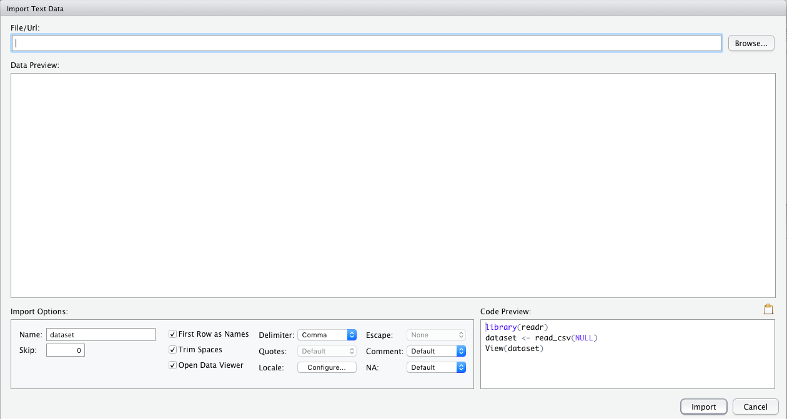

Export, Upload, Import
======================
transition: none
css: ../../IDSLabCSS.css

Lab 1C

Directions: Follow along with the slides and answer the questions in **red** font in your journal.


Whose data? Our data.
====================

- Throughout the previous labs, we've been using data that was already loaded in RStudio.
    - But what if we want to analyze our own data?
- This lab is all about learning how we to load our own participatory sensing data into RStudio


Export, upload, import
========================================================
- Before we can perform any analysis, we have to load data into R. 
- When we want to get our participatory sensing data into RStudio, we:
  - <font color="green">Export</font> the data from the _Mobilize_ server.
  - <font color="green">Upload</font> data to _RStudio_ server
  - <font color="green">Import</font> the data into R's working memory
  

Exporting
========================================================

- To begin, go to the Mobilize Landing,  `https://lausd.mobilizingcs.org/landing/` 
  - Click on the <font color="green">Campaign Manager</font>
  - Fill in your username and password and click "Sign in."
<center></center>
If you forget your username or password, ask your teacher to remind you. 

Campaign Manager
========================================================

<center></center>

- After logging in, your screen should look similar to this.
- Click on the dropdown arrow for the campaign you are interested in downloading.

Dropdown Arrow
========================================================

- The options for the dropdown menu will look like this. 
<center></center>
- Look for the option labeled <font color="green">Export Data</font>. Click it.
  - Remember where you save your file!

Exporting
========================================================

- When you clicked the <font color="green">Export</font> link a _.csv_ file was saved on your computer.
- Now that the file is on your computer, we need to <font color="green">upload</font> it into RStudio.


Uploading
========================================================

- Look at the four different _panes_ in RStudio.
  - Find the _pane_ with a <font color="green">Files</font> tab.
  - Click it!


Uploading
========================================================
<center>  </center>

- Click the button on the Files pane that says "Upload"
  - Find the SurveyResponses.csv file you saved to your computer.
  - Hit the _ok_ button a few times.
- Voila!
  - If you look in the <font color="green">Files</font> pane, you should be able to find your data!


Upload vs. Import
========================================================

- By <font color="green">Uploading</font> your data into RStudio you've really only given yourself access to it.
  - Don't believe me? Look at the <font color="green">Environment</font> pane ... where's your data?
- To actually use the data we need to <font color="green">Import</font> it into your computer's memory.
- To compute more quickly and efficiently, R will only keep a few data sets stored in its memory at a time.
    - By importing data, you are telling R that this is a data set that is important to store it in its memory so you can use it.


Importing
========================================================

<center></center>

- At the top of the Environment pane, click the "Import Data set" button. Then, choose "From Text File."
- Find your _SurveyResponse_ data and then click _Open_.


Data Preview
========================================================
<center></center>

- Give your data a <font color="green">Name</font>. This is the name you'll use in your code.
    - Good names are short and descriptive. Maybe a good name for this data is "foodhabits".
- When you're ready, click the _Import_ button.


read.csv()
========================================================

- After you click import you might notice something appeared in your console.

```r
data.file <- read.csv("~/SurveyResponse.csv")
View(data.file)
```

- We can actually <font color="green">Import</font> the data without clicking the button!
  - This would allow you to load data by writing code! 
  - This might come in handy later in the course.

A word on staying organized...
==============================
<center>  </center>

- The <font color="green">Files</font> tab has a few other features to help keep you organized.
  - _SurveyResponse_ probably isn't the best name for your data. Click <font color="green">Rename</font> to give it a clearer name.
  - Often, it's helpful to give your data file the same name as when you import your data.
  - So in this case, we could name our data file _foodhabits.csv_


Export, upload, import
========================================================

- After you _export_, _upload_, _import_ your data you're ready to analyse. 
- **`View` your data, select a variable and try to make an appropriate plot for that variable.**
    - If you're having issues, make sure you're spelling the name of your data correctly.
- Re-import your data, but this time, turn the _Heading_ option to _No_
    - **`View` the data now and describe how selecting the _No_ option for the the _heading_ changed your data. What is a heading?**
