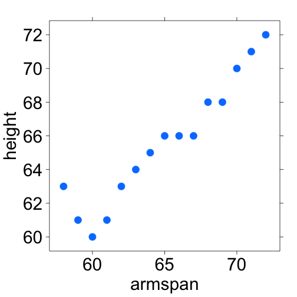

Cross-Validation
===
transition: none
css: ../../IDSLabCSS.css

Lab 4C

Directions: Follow along with the slides and answer the questions in **red** font in your journal.


Predictions
===

- In the previous lab, we learned how to calculate the _mean squared error_ (MSE).
    - This let us measure how well our model predicts values of our `y`-variable.
- To really measure how well our _line of best fit_ predicts people's `heights`, we want see how well we predict the `heights` of people that we haven't yet measured.
- To do this, we'll divide our data into two sets:
    - A _training_ set used to build our model.
    - And a _testing_ set we can use to measure how well our model predicts _new_ data values.
- This method of dividing data into sets is called _cross-validation_.


Why cross-validate?
===

- Data scientists are often tasked with predicting some aspect of future observations.
    - Relying on a single data set to both _train_ and _test_ models can lead to models that are so specific to the current batch of data that they're unable to make good predictions for these future observations.
- Cross-validating allows data scientists to measure how well their models predict new observations.
    - It also gives them the ability to compare different models to see which models make better/worse predictions.


Splitting the data
===

- Waiting for new observations can take a long time. The U.S. takes a census of its population once every 10 years, for example.
- Instead of waiting for new observations, data scientists will take their current data and divide it into two distinct sets.
- For our `arm_span` data, fill in the blanks to create a `training` and `testing` data set.

```r
set.seed(123)
train_rows <- sample(1:____, size = 85)
train <- slice(arm_span, ____)
test <- slice(____, - ____)
```

- **Explain these lines of code and describe the `train` and `test` data sets.**


set.seed then split
===

- When we split data, we're randomly separating our observations into _training_ and _testing_ sets.
    - It's important to notice that no single observation will be placed in both sets.
- Because we're splitting the data sets randomly, our models can will also vary slightly, person-to-person.
    - This is why it's important to use `set.seed`.
- By using `set.seed`, we're able to reproduce the random splitting so that each person's model outputs the same results.

_Whenever you split data into training and testing, always use `set.seed` first._


Building on training
===

- When splitting data into _training_ and _testing_ sets, we need to have enough observations in our data so that we can build a good model.
    - This is why we kept 85 observations in our `training` data.
- As data sets grow larger, we can use a larger proportion of the data to _test_ with.
- Fit a _line of best fit_ model to our training data and assign it the name `best_train`.


Predicting on testing
===

- Now that our model has been built, we can use it to predict the values of `height` in our `test` data.
- Because we're using the _line of best fit_, we can use the `predict()` function we introduced in the last lab to make predictions.
    - Fill in the blanks below to add predicted heights to our `test` data:

```r
test <- mutate(test, ____ = predict(best_train, newdata = ____))
```

- Calculate the MSE in the same way as you did in the previous lab. 

Avoiding being too specific
===

- When we build models without cross-validating, we run the risk of building models that are _too_ specific to the data we already have.
    - Meaning, the model predicts values we know about really well BUT predicts new values very poorly.
- The plot on the following slide shows a single, randomly chosen `height` for each value of `armspan`.
    - **With a neighbor, write down a prediction rule that would predict a person's `height` based on their `armspan` really well for people already shown in our plot but would predict people not in our plot very poorly.**


===



- **With a neighbor, write down a prediction rule that would predict a person's `height` based on their `armspan` really well for people already shown in our plot but would predict people not in our plot very poorly.**

