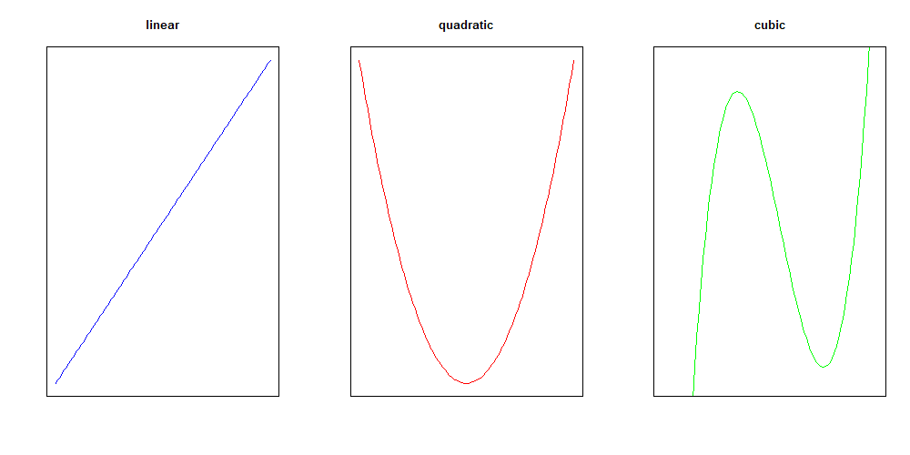

```{r setup, include=FALSE}
knitr::opts_chunk$set(echo = FALSE)
```

```{r, eval=TRUE, echo=FALSE, results='hide', message=FALSE, warning=FALSE}
library(mobilizr)
```

## Making models do yoga

- So far, we have only worked with prediction models that fit the _line of best fit_ to the data.
- What happens if the true relationship between the data is nonlinear?
- In this lab, we will learn about prediction models that fit _best fitting curves_ to data.
- **Before moving on, load the `movie` data and split it into two sets:**
    - **A set named `training` that includes 75% of the data.**
    - **And a set named `testing` that includes the remaining 25%.**
    - Remember to use `set.seed`.


## Problems with lines

- Before learning how to fit curves, let's first fit a linear model for reference.
- **Train a linear model predicting `audience_rating` based on `critics_rating` for the `training` data. Assign this model to `movie_linear`.**
- **Fill in the blanks below to create a scatterplot with `audience_rating` on the y-axis and `critics_rating` on the x-axis using your `testing` data.**
    
```{r, eval = FALSE, echo = TRUE}
xyplot(____ ~ ____, data = ____)
```

- Previously, you used `add_line` to plot the _line of best fit_. An alternative function for plotting the _line of best fit_ is `add_curve`, which takes the name of the model as an argument.
- **Run the code below to add the _line of best fit_ for the `training` data to the plot.**

```{r, eval = FALSE, echo = TRUE}
add_curve(movie_linear)
```

- **Describe, in words, how the line fits the data. Are there any values for `critics_rating` that would make obviously poor predictions?**
    - Hint: how does the linear model perform on very low and very high values of `critics_rating`?
- **Compute the MSE of the linear model for the `testing` data and write it down for later.**
    - Hint: refer to lab 4B.


## Adding flexibility

- You don't need to be a full-fledged Data Scientist to realize that trying to fit a line to curved data is a poor modeling choice.
- If our data is curved, we should try to model it with a curve.
- Instead of fitting a line, with equation of the form
<center>`y = a + bx`</center>
- we might consider fitting a _quadratic curve_, with equation of the form
<center>`y = a + bx + cx`<sup>`2`</sup></center>
- or even a _cubic curve_, with equation of the form
<center>`y = a + bx + cx`<sup>`2`</sup>`  + dx`<sup>`3`</sup></center>
- In general, the more coefficients in the model, the more flexible its predictions can be.

```{r, out.width="50%", out.height="50%"}

```


## Making bend-y models

- To fit a quadratic model in `R`, we can use the `poly()` function.
    - **Fill in the blanks below to train a quadratic model predicting `audience_rating` from `critics_rating`, and assign that model to `movie_quad`.**

```{r, eval = FALSE, echo = TRUE}
movie_quad <- lm(____ ~ poly(____, 2), data = training)
```

- **What is the role of the number `2` in the `poly()` function?**

## Comparing lines and curves

- **Fill in the blanks below to**
    - **create a scatterplot with `audience_rating` on the y-axis and `critics_rating` on the x-axis using your `testing` data, and**
    - **add the _line of best fit_ and _best fitting quadratic curve_.**
    - Hint: the `col` argument is added to the `add_curve` functions to help distinguish the two curves.
    
```{r, eval = FALSE, echo = TRUE}
xyplot(____ ~ ____, data = ____)
add_curve(____, col = "blue")
add_curve(____, col = "red")
```

- **Compare how the _line of best fit_ and the _quadratic_ model fit the data. Which do you think has a lower `test` MSE?**
- **Compute the MSE of the quadratic model for the `test` data and write it down for later**.
- **Use the difference in each model's `test` MSE to describe why one model fits better than the other.**

## On your own

- **Create a model that predicts `audience_rating` using a cubic curve (polynomial with degree `3`), and assign this model to `movie_cubic`**.
- **Create a scatterplot with `audience_rating` on the y-axis and `critics_rating` on the x-axis using your `test` data.**
- **Using the names of the three models you have trained, add the _line of best fit_, _best fitting quadratic curve_, and _best fitting cubic curve_ for the `training data` to the plot.**
- **Based on the plot, which model do you think is the best at predicting the `testing` data?**
- **Use the difference in testing MSE to verify which model is the best at predicting the `testing data`.**