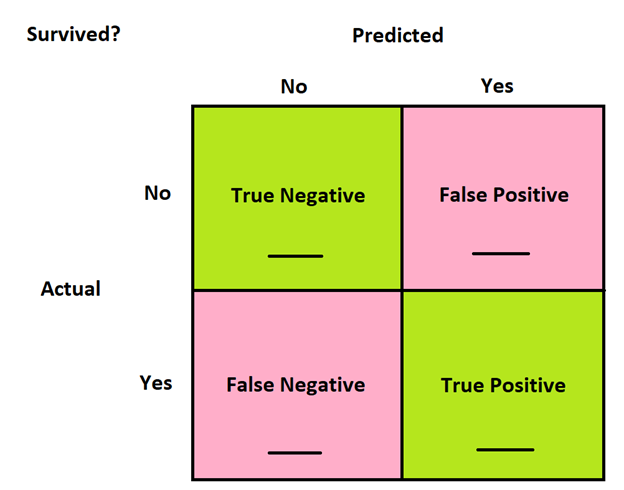
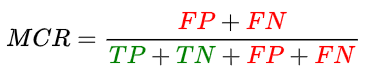

```{r setup, include=FALSE}
knitr::opts_chunk$set(echo = FALSE)
```

```{r, eval=TRUE, echo=FALSE, results='hide', message=FALSE, warning=FALSE}
library(mobilizr)
```

## Trees vs. Lines

- So far in the labs, we've learned how we can fit linear models to our data and use them to make predictions.
- In this lab, we'll learn how to make predictions by growing trees.
    - Instead of creating a line, we split our data into branches based on a series of _yes_ or _no_ questions.
    - The branches help sort our data into _leaves_ which can then be used to make predictions.
- <span class="blue">Start by loading the `titanic` data.</span>


## Our first tree

- <span class="blue">Use the `tree()` function to create a _classification_ tree that predicts whether a person `survived` the Titanic based on their `gender`.</span>
    - A _classification_ tree tries to predict which category a categorical variable would belong to based on other variables.
    - The syntax for `tree` is similar to that of the `lm()` function.
    - <span class="blue">Assign this model the name `tree1`.</span>

- **Why can't we just use a _linear model_ to predict whether a passenger on the Titanic `survived` or not based on their `gender`?**


## Viewing trees

- <span class="blue">To actually look at and interpret our `tree1`, place the model into the `treeplot` function.</span>
    - **Write down the labels of the two _branches_.**
    - **Write down the labels of the two _leaves_.**
- **Answer the following, based on the `treeplot`:**
    - **Which `gender` does the model predict will survive?**
    - **Where does the plot tell you the number of people that get sorted into each leaf? How do you know?**
    - **Where does the plot tell you the number of people that have been sorted _incorrectly_ in each leaf?**


## Leafier trees

- <span class="blue">Similar to how you included multiple variables for a linear model, create a `tree` that predicts whether a person `survived` based on their `gender`, `age`, `class`, and where they `embarked`.</span>
    - <span class="blue">Assign this model the name `tree2`.</span>
- **Create a `treeplot` for this model and answer the following question:**
    - **Mrs. Cumings was a 38 year old female with a 1st class ticket from Cherbourg. Does the model predict that she survived?**
    - **Which variable ended up not being used by `tree`?**


## Tree complexity

- By default, the `tree()` function will fit a _tree model_ that will make good predictions without needing lots of branches.
- We can increase the complexity of our trees by changing the complexity parameter, `cp`, which equals `0.01` by default.
- We can also change the minimum number of observations needed in a leaf before we split it into a new branch using `minsplit`, which equals `20` by default.
- <span class="blue">Using the same variables that you used in `tree2`, create a model named `tree3` but include `cp = 0.005` and `minsplit = 10` as arguments.</span>
    - **How is `tree3` different from `tree2`?**

## Making predictions

- Just like with _linear models_, we can use cross-validation to measure how well our _classification trees_ perform on unseen data.
- First, we need to compute the predictions that our model makes on test data.
    - <span class="blue">Use the `data` function to load the `titanic_test` data.</span>
    - <span class="blue">Fill in the blanks below to predict whether people in the `titanic_test` data survived or not using `tree1`.</span>
    - Note: the argument `type = "class"` tells the `predict` function that we are predicting a categorical variable and not a numerical variable.

```{r, eval = FALSE, echo = TRUE}
titanic_test <- mutate(____, prediction = predict(____, newdata = ____, type = "class"))
```

## Tabulating results

- Now that we have predictions on the test data, we need a way to measure the accuracy of those predictions.
- Before that, let's first summarize all of our predictions using a table.
- Specifically, the table should display the actual outcomes vs. the predicted outcomes.
- <span class="blue">Fill in the blanks below to create a table for the actual results vs. the predictions of `tree1` on `titanic_test`.</span>

```{r, eval = FALSE, echo = TRUE}
tally(survived ~ ___, data = ___)
```

- Note: Tables with actual outcomes vs. predicted outcomes are called _confusion matrices_. They are called such because they tell us when our model _confuses_ one class for another.

## Interpreting the confusion matrix

- The diagram below represents the layout of your confusion matrix.
- The green boxes are where the classification tree was correct. A _true positive_ occurs when the classification tree correctly predicts that a passenger survived, and a _true negative_ occurs when the classification tree correctly predicts that a passenger did not survive.
- Conversely, the red boxes are where the classification tree was incorrect. A _false positive_ occurs when the classification tree predicts that a passenger survived when they actually did not survive, and a _false negative_ occurs when the classification tree predicts that a passenger did not survive when they actually survived.
- **Why do you think the boxes are given these names?**
- **Copy the diagram below in your journal, and fill the blanks in with the outputs of your confusion matrix**.

```{r, out.width="50%", out.height="50%"}

```

- **Which entries of the confusion matrix would we like to maximize? Which would we like to minimize? Why?**
- **How can the confusion matrix be used to measure model performance?**

## Measuring model performance

- We would like a numerical measure for the performance of our classification tree, similar to _mean squared error_ for linear models.
- One reasonable way to measure performance would be to compute the proportion of the time that our classification tree makes a correct prediction. Thus, we have the following formula:

```{r, out.width="50%", out.height="50%"}

```

- MCR stands for _misclassification rate_. TP, TN, FP, and FN correspond to entries of the confusion matrix.
- <span class="blue">Use this formula to compute the MCR of `tree1`</span>.
- **In your own words, explain what MCR represents.**

## Misclassification rate (this would be replaced by previous slides)

- Similar to how we use the _mean squared error_ to describe how well our model predicts numerical variables, we use the _misclassification rate_ to describe how our model predicts categorical variables.
    - The _misclassification rate_ (MCR) is the number of people who were predicted to be in one category but were actually in another.
    - <span class="blue">Fill in the blanks to create a function to calculate the MCR.</span>
    - Note: The operator `!=` checks if the left hand side and right hand side are _not_ equal. It is the opposite of `==`.

```{r, eval = FALSE, echo = TRUE}
calc_mcr <- function(actual, predicted) {
  sum(____ != ____) / length(____)
}
```

- <span class="blue">Then run the following to calculate the MCR.</span>

```{r, eval = FALSE, echo = TRUE}
summarize(titanic_test, mcr = calc_mcr(survived, prediction))
```

## On your own

- **In your own words, explain what the _misclassification rate_ is.**
- **Which model (`tree1`, `tree2` or `tree3`) had the lowest misclassification rate for the `titanic_test` data?**
- <span class="blue">Create a 4th model using the same variables used in `tree2`. This time though, change the _complexity parameter_ to `0.0001`. Then answer the following.</span>
    - **Does creating a more complex _classification tree_ always lead to better predictions? Why not?**
- <span class="blue">A _regression tree_ is a tree model that predicts a numerical variable. Create a _regression tree_ model to predict the Titanic's passengers' ages and calculate the MSE.</span>
    - Plots of regression trees are often too complex to plot.